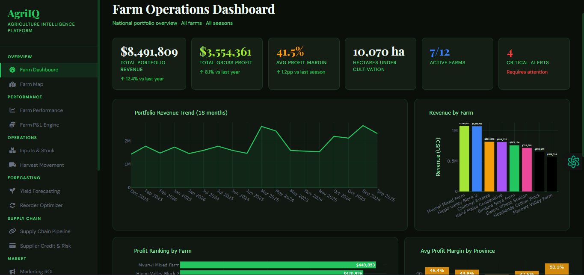
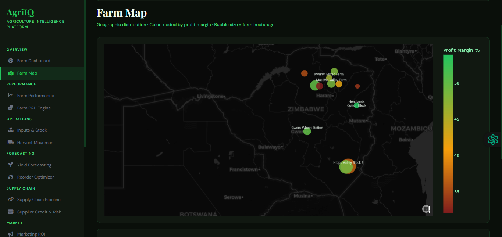
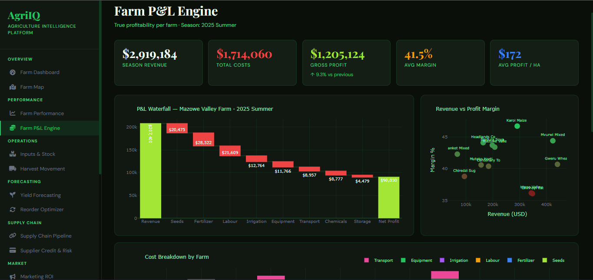
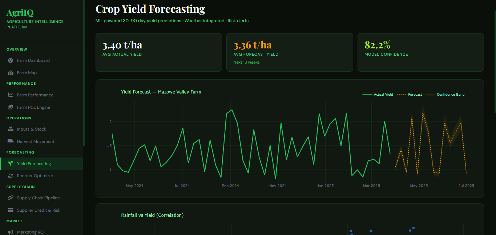
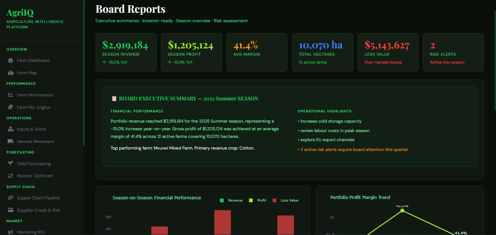

# 🌾 AgriIQ — Agriculture Intelligence Platform

> A full-stack, 17-module agriculture analytics and intelligence dashboard built for Zimbabwe's commercial farming sector. Covers everything from real-time input tracking to ML-powered yield forecasting, supply chain visibility, and board-ready executive reporting.


---

## 🚀 Live Demo

**[View Live →](https://web-production-c8185.up.railway.app/)**

---

## 📸 Screenshots

### Farm Operations Dashboard


### Farm Map - Geographic Intelligence


### Farm P&L Engine


### Yield Forecasting


### Board Reports


> *Screenshots are located in the `/screenshots` folder. Add your own screenshots there.*

---

## 📊 17 Intelligence Modules

| # | Module | Description |
|---|--------|-------------|
| 01 | 🌍 Farm Operations Dashboard | National portfolio overview — revenue, profit, alerts |
| 02 | 🗺️ Farm Map | Geographic farm distribution — color-coded by profitability |
| 03 | 📈 Farm Performance | Revenue, yield and efficiency rankings across all farms |
| 04 | 💰 Farm P&L Engine | Waterfall P&L per farm — seeds, fertilizer, labour, transport |
| 05 | 📦 Inputs & Stock Monitor | Real-time inventory tracking — critical stock alerts |
| 06 | 🚚 Harvest Movement | Crop flow from field → storage → market |
| 07 | 🤖 Crop Yield Forecasting | ML-powered 30-90 day yield predictions with weather integration |
| 08 | 🔄 Reorder Optimizer | Smart input purchasing — planting window aligned |
| 09 | 🌾 Supply Chain Pipeline | End-to-end harvest-to-market shipment tracking |
| 10 | 💳 Supplier Credit & Risk | Credit utilization, overdue accounts, suspension alerts |
| 11 | 📢 Marketing ROI Tracker | Campaign spend vs revenue lift across channels |
| 12 | 🏪 Market Price Watch | GMB vs Private vs Export pricing |
| 13 | 💬 Buyer Satisfaction | Satisfaction scores, complaints, repeat order rates |
| 14 | 👨‍🌾 Labour Intelligence | Workforce composition, cost per hectare, productivity |
| 15 | 💔 Post-Harvest Loss | Spoilage, theft, pest damage — intervention recommendations |
| 16 | 🌧️ Agri-Economic Watch | Rainfall, drought index, fuel, electricity, FX, global prices |
| 17 | 📄 Board Reports | Executive summaries, risk register, investor-ready snapshots |

---

## 🏗️ Tech Stack

| Layer | Technology |
|-------|-----------|
| Framework | Plotly Dash 2.17 |
| Data Processing | Pandas, NumPy |
| Visualisation | Plotly, Mapbox |
| Deployment | Railway |
| Process Manager | Gunicorn |
| Styling | Custom CSS — Dark Agri Theme |
| Icons | Font Awesome 6 |

---

## 📁 Project Structure

```
Agriculture-Intelligence-Platform/
│
├── app.py                    # Main Dash application
├── Procfile                  # Railway deployment
├── railway.json              # Railway build config
├── requirements.txt          # Python dependencies
├── runtime.txt               # Python version
│
├── data/
│   ├── generate_data.py      # Synthetic dataset generator
│   └── csv/                  # Generated CSV datasets (17 files)
│       ├── farms.csv
│       ├── monthly_performance.csv
│       ├── pnl.csv
│       ├── inventory.csv
│       ├── harvest_movement.csv
│       ├── yield_forecast.csv
│       ├── reorder_optimizer.csv
│       ├── supply_chain.csv
│       ├── supplier_credit.csv
│       ├── marketing_roi.csv
│       ├── market_prices.csv
│       ├── buyer_satisfaction.csv
│       ├── labour.csv
│       ├── losses.csv
│       ├── economic_watch.csv
│       ├── board_summary.csv
│       └── weather.csv
│
├── modules/                  # 17 dashboard modules
│   ├── m01_overview.py
│   ├── m02_farm_map.py
│   ├── m03_performance.py
│   ├── m04_pnl.py
│   ├── m05_inventory.py
│   ├── m06_harvest_movement.py
│   ├── m07_yield_forecast.py
│   ├── m08_reorder.py
│   ├── m09_supply_chain.py
│   ├── m10_supplier_credit.py
│   ├── m11_marketing_roi.py
│   ├── m12_market_prices.py
│   ├── m13_buyer_satisfaction.py
│   ├── m14_labour.py
│   ├── m15_losses.py
│   ├── m16_economic_watch.py
│   └── m17_board_reports.py
│
├── utils/                    # Shared utilities
│   ├── __init__.py
│   ├── data_loader.py        # CSV data loading functions
│   └── helpers.py            # Colors, formatting, KPIs, export functions
│
├── assets/                   # Static assets (optional)
│   └── style.css
│
└── screenshots/              # Screenshots for README
    ├── dashboard.png
    ├── farm_map.png
    ├── pnl_engine.png
    ├── yield_forecast.png
    └── board_reports.png
```

---

## ⚙️ Local Setup

```bash
# 1. Clone the repo
git clone https://github.com/AnesuManjengwa/Agriculture-Intelligence-Platform.git
cd Agriculture-Intelligence-Platform

# 2. Create virtual environment
python -m venv venv
source venv/bin/activate        # Windows: venv\Scripts\activate

# 3. Install dependencies
pip install -r requirements.txt

# 4. Generate all datasets
python data/generate_data.py

# 5. Run the app
python app.py
```

Open **http://localhost:8050** in your browser.

---

## 🚀 Deploy to Railway

```bash
# 1. Install Railway CLI
npm install -g @railway/cli

# 2. Login
railway login

# 3. Link to existing project or create new
railway link

# 4. Deploy
railway up

# 5. Open in browser
railway open
```

Railway automatically runs `generate_data.py` then starts Gunicorn via `railway.json`.

---

## 📤 Export Features

- **CSV Export** — Download any dataset as CSV
- **Search & Filter** — Search farms by name, province, or crop
- **Mobile Responsive** — Sidebar collapses on mobile devices
- **Auto-refresh** — Data refreshes every 5 minutes (configurable)

---

## 🌍 Zimbabwe Agricultural Context

AgriIQ is built specifically for Zimbabwe's agricultural landscape:

- **Tobacco** — TIMB auction floors, contract farming
- **Maize** — GMB (Grain Marketing Board), Strategic Grain Reserve
- **Cotton** — COTTCO ginneries
- **Sugar** — Hippo Valley, Triangle Ltd
- **Horticulture** — EU and South Africa export markets
- **12 farms** across 5 provinces: Mashonaland Central, Mashonaland West, Masvingo, Mashonaland East, Midlands

---

## 📈 Dataset Overview

| Dataset | Rows | Description |
|---------|------|-------------|
| farms | 12 | Farm master data with geo coordinates |
| monthly_performance | 288 | 24-month revenue/profit per farm |
| pnl | 36 | Full P&L per farm per season |
| inventory | 145 | Input stock levels and status |
| harvest_movement | 306 | Crop movement transactions |
| yield_forecast | 792 | Historical + ML forecast yield data |
| reorder_optimizer | 61 | Input reorder recommendations |
| supply_chain | 180 | Shipment pipeline records |
| supplier_credit | 96 | Supplier credit and payment data |
| marketing_roi | 96 | Campaign ROI data |
| market_prices | 2,920 | Daily commodity prices across channels |
| buyer_satisfaction | 144 | Buyer feedback scores |
| labour | 144 | Workforce and cost data |
| losses | 252 | Post-harvest loss records |
| economic_watch | 365 | Daily economic indicators |
| board_summary | 3 | Season executive summaries |
| weather | 2,190 | Station weather data |

**Total: ~7,500+ rows across 17 datasets**

---

## 🎯 Target Users

| User | Key Modules |
|------|-------------|
| **Farm Owners / CEOs** | Overview, Board Reports, P&L |
| **Farm Managers** | Performance, Inventory, Labour |
| **Agronomists** | Yield Forecasting, Pest Alerts |
| **Procurement Managers** | Reorder Optimizer, Supplier Credit |
| **Finance Teams** | P&L Engine, Supplier Payments |
| **Marketing Teams** | Price Watch, Marketing ROI |
| **Investors / Banks** | Board Reports, Risk Assessment |

---

## 🔧 Environment Variables (Optional)

| Variable | Description | Default |
|----------|-------------|---------|
| `PORT` | Server port | 8080 |
| `DEBUG` | Debug mode | False |
| `REFRESH_INTERVAL` | Auto-refresh seconds | 300 |

---

## 🤝 Contributing

This is a proprietary project. For inquiries or custom development:

- **Email**: manjengwap10@gmail.com
- **Website**: [MA TechHub](https://matechhub-website.vercel.app)

---

## 📝 License

Copyright © 2026 Anesu Manjengwa. All rights reserved.

This software and its source code are proprietary and confidential. Unauthorized copying, distribution, modification, or use of this software is strictly prohibited.

---

## 👤 Author

**Anesu Manjengwa**  
Data Analytics & Dashboard Consultant  
[MA TechHub](https://matechhub-website.vercel.app) · manjengwap10@gmail.com

---

## 🙏 Acknowledgments

- Plotly Dash team for the amazing framework
- Zimbabwe Grain Marketing Board (GMB) for market data inspiration
- Local farmers who provided requirements and feedback

---

## 📞 Support

For issues or questions about the live deployment:
- Open an issue on GitHub
- Contact: manjengwap10@gmail.com

```

The README now accurately reflects your current repository structure with the `utils/` folder, all 17 modules, and includes screenshot placeholders!
